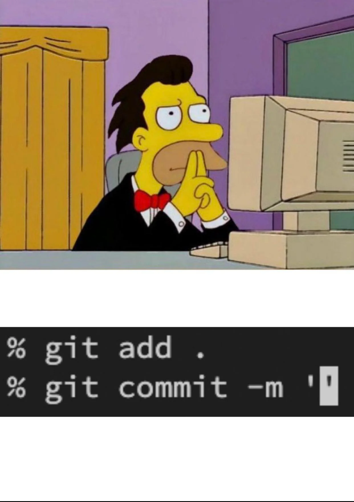
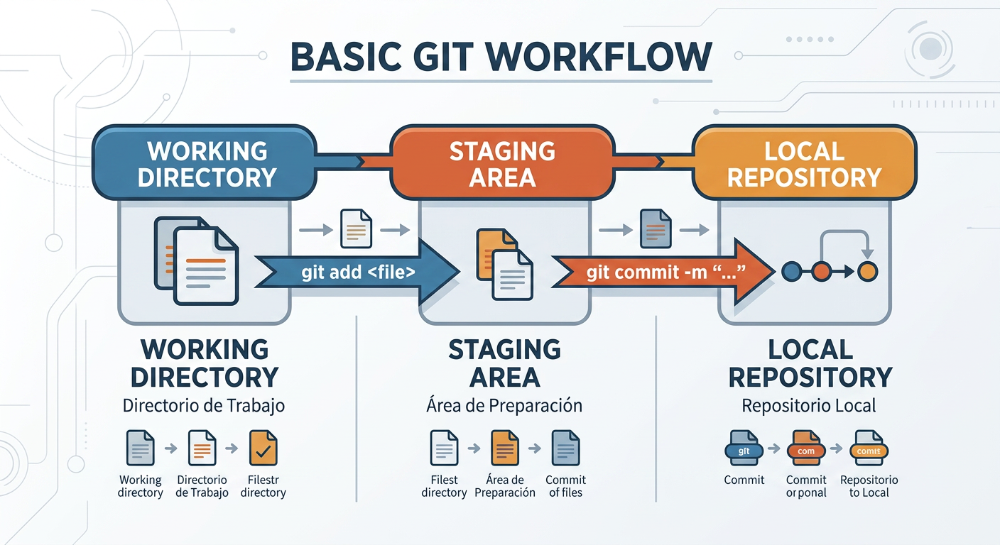

# Trabajo Individual

**Nombre:** Gabriel Bazualdo Rojas  
**Correo:** bazualdogabriel@gmail.com 

## Clase 1
### ¿ Que es Git?

Es un sistema de control de versiones distribuido (VCS), que permite guardar
archivos y sus versiones. 
Esto sirve para no perder información y poder regresar a versiones anteriores
si algo sale mal.

### ¿Como nacio Git?

Fue creado por Linus Torvalds  porque había problemas con otras herramientas,
entonces su decidió hacer su propia solución en para el control de versiones,
la cual le llevo unas 2 a 3 semanas.

### ¿Como instalar git?

Para instalar Git se debe ir a la página oficial https://git-scm.com/install/
y descargarlo según el sistema operativo.

Después de instalarlo, se puede verificar con el siguiente comando en la terminal:
```
git --version
```
Si muestra la versión, significa que está bien instalado.

### Configuraciones Básica

Después de instalar Git, es necesario configurarlo con nuestros datos:
```
git config --global user.name "Tu Nombre"

git config --global user.email "tu@correo.com"

git config --global core.autocrlf true
```
Esto sirve para identificar quién hace los cambios en el repositorio.

### Achivos que todo repo deberia tener

- README.md
- .gitignore
---
## Clase 2
### States y Commits

### Los Estados de Git
Git tiene 3 estados principales por donde pasan nuestros archivos:

1. **Directorio de Trabajo (Working Directory):** Donde tengo mis archivos 
y los modifico.Git ya sabe que existen, pero los cambios todavía no están 
guardados en el historial.

2. **Área de Preparación (Staging Area):** Es como una zona de espera.Aquí 
pongo los cambios que ya están listos y que quiero incluir en mi próximo commit.

3. **Repositorio Local (Repository):** Una vez que hago commit, los cambios 
que estaban en el Staging Area se guardan de forma permanente en el historial 
de mi proyecto.



### 1. Directorio de Trabajo (Modificado)
Cuando trabajo en mis archivos, Git los ve así:

- **Untracked:** Archivos nuevos que acabo de crear y que Git todavía no sigue.
- **Modified:** Archivos que ya estaban en Git pero que he modificado.

#### ¿Cómo descartar cambios?
Si hice un cambio en un archivo pero me arrepentí y quiero volver a como estaba 
en el último commit, puedo usar:
```
git restore <archivo>
```
> **Ojo:** ¡Esto borra fisicamente los cambios para siempre!

#### Ignorar archivos con `.gitignore`
Para que Git no de seguimiento a  ciertos archivos los añado a un archivo 
llamado .gitignore.

Ejemplo de mi .gitignore:
```
# Directorios y archivos ignorados por Git
venv/
__pycache__/
.env
*.log
```

### 2. Área de Preparación (Staging Area)
Es donde preparo mi siguiente commit, para añadir archivos a esta zona:
- Para añadir un solo archivo
```git add <archivo>```
- Para añadir todos los archivos nuevos y modificados
```git add .```

Si me equivoqué y quiero sacar un archivo del Staging Area:
```git restore --staged <archivo>```

### 3. Repositorio Local (Confirmado)
Es la ultima fase, los cambios se guardan en el historial.
- Para crear el commit:
```git commit -m "Un mensaje que explique qué hice"```
- Si quiero deshacer el último commit:
```git reset --soft HEAD~1```

### Buenas Prácticas para Commits
**Commits Atómicos**  
La idea es que cada commit sea un cambio pequeño y único.Es mejor hacer 
varios commits pequeños que uno grande con un montón de cambios mezclados.  
**Escribir buenos commits**  
Deben describir lo que hacen en pocas palabras:

1. Usar verbos en imperativo: Empezar el mensaje con Add, Change, Fix, Remove.
2. Sin punto al final ni puntos suspensivos.
3. Máximo 50 caracteres en el título.
4. Usar prefijos: Ayuda a saber de qué va el commit a simple vista.

	```git commit -m "<tipo de commit>: <descripción>"```
	
	Ejemplo:
	
	```git commit -m "feat: Add new search feature"```

	Los prefijos más comunes:

	- feat: Una funcionalidad nueva.
	- fix: Arreglar un error (bug).
	- perf: Un cambio para mejorar el rendimiento.
	- docs: Cambios en la documentación.
	- style: Cambios de formato (espacios, comas, etc.).
	- refactor: Reorganizar código sin cambiar lo que hace.
	- test: Añadir o arreglar tests.
	- build: Cambios que afectan el sistema de build.
	- ci: Cambios en la integracion continua

5. Añadir más detalles si es necesario en el cuerpo del commit: 
Si el título no es suficiente, puedo usar ```git commit```
(sin -m) para escribir un cuerpo más largo.
```
prefijo: Titulo de tu commit

Cuerpo que describe tu commit
```
---
## Clase 3
### ¿Qué es GitHub?
GitHub es una plataforma en la nube que funciona como una red social 
para desarrolladores.
Permite alojar repositorios y trabajar en equipo usando Git.
### Git vs GitHub
- **Git:** sistema de control de versiones que guarda los cambios (commits).
- **GitHub:** plataforma donde se suben esos cambios para compartirlos.
### SSH vs HTTPS
Cuando trabajamos con repositorios remotos, podemos usar:
- HTTPS:
	- Pide autenticación constantemente (usuario o token)
	- Es más incómodo
- SSH:
	- Usa una clave para autenticarse
	- No pide contraseña cada vez
	- Es más práctico

> Por eso se recomienda usar SSH.
### Configuración de SSH
Para configurar SSH:
1. Generar una clave:
``` ssh-keygen -t ed25519 -C "tu-correo@email.com" ```

2. Ver la clave pública:
``` cat ~/.ssh/id_ed25519.pub ```

3. Copiar la clave y agregarla en GitHub:
- Ir a Settings
- SSH and GPG Keys
- New SSH Key
- Pegar la clave
4. Verificar conexión:
```ssh -T git@github.com```

### Crear un repositorio en GitHub
Pasos:
1. Ir a GitHub
2. Ir a repositorios
3. Click en “New”
4. Colocar nombre y crear repositorio
### Conectar un repositorio local de Git existente con uno de GitHub
```
git remote add origin git@github.com:TuUser/TuRepo.git
git branch -M main
git push -u origin main
```
Esto conecta el repositorio local con el remoto.
### Clonar un repositorio
```
git clone git@github.com:TuUser/TuRepo.git
```

Si se usó HTTPS por accidente: 
```
git remote set-url origin git@github.com:TuUser/TuRepo.git
```

Para ver la conexión remota:
```
git remote -v
```
### Subir y bajar cambios
Subir cambios:
```
git push origin main
```
Bajar cambios:
```
git pull origin main
```
---
## Clase 4
### Remote
Es la conexión a un repositorio en internet. Por defecto, se llama origin.

### SSH
Protocolo de conexión segura que usa llaves (pública y privada) para no tener 
que escribir la contraseña.

###Múltiples Remotos
Un repositorio local puede conectarse a varios remotos a la vez.
Checkout

Comando para cambiar de rama y trabajar en local antes de subir los cambios.
### Git Remote

Comando para administrar las conexiones remotas.

`git remote -v`   : Ver las conexiones.

`git remote add <nombre> <url>`  : Añadir una nueva conexión.

`git remote remove <nombre>`   : Quitar una conexión.

### Subir Cambios (git push)

Envía los commits locales al repositorio remoto.
bash

`git push <remoto> <rama>`

### Bajar Cambios (git pull)

Trae los cambios del repositorio remoto al local.
bash

`git pull <remoto> <rama>`

### Clonar un Repositorio (git clone)

Descarga una copia completa de un repositorio remoto existente.
bash

`git clone <url-del-remoto>`

---
## Clase 5

### RAMAS Y GITFLOW BÁSICO
La base del trabajo remoto en equipo con GIT.

### ¿QUÉ SON LAS RAMAS?
Son como clones de tu proyecto.Se trata de una 
**bifurcación del estado del código que crea un nuevo camino** , creas 
una rama para trabajar en algo nuevo (una nueva función, un arreglo) 
sin miedo a romper el código principal. Es como tener un borrador aparte.

### GIT BRANCH
`git branch` es un comando que nos permite gestionar las ramas que tiene o 
tendrá nuestro proyecto.

*   **`git branch`**
    *   Nos permite listar las ramas disponibles y nos muestra el 
posicionamiento actual de nuestro HEAD.

*   **`git branch <rama>`**
    *   Crea una rama a partir de la rama que estamos posicionados.

*   **`git branch -D <rama>`**
    *   Borra la rama.

### GIT CHECKOUT ENFOCADO EN RAMAS
Si bien `git checkout` lo usamos previamente para ver nuestros archivos 
pasados mediante los commits, también puede ser usado junto con las ramas para:

*   **`git checkout <rama>`**
    *   Permite cambiar de ramas.
    *   *Importante:* No debemos tener nada en estado `modified`, `untracked` 
o `staged` para poder usarlo.

*   **`git checkout -b <rama>`**
    *   Crea una nueva rama y se mueve a ella directamente en un solo paso.

### GIT CHECKOUT VS. GIT SWITCH
#### ¿Por qué existen ambos?
Antes, `git checkout` hacía muchas cosas (cambiar ramas, ir a commits, 
restaurar archivos), lo que podía causar errores.  
Desde Git 2.23 se creó `git switch` para enfocarse solo en ramas y hacerlo 
más seguro.

*   **`git checkout`** : comando antiguo y multipropósito, pero puede causar 
errores como *Detached HEAD*.
*   **`git switch`**: comando moderno, solo para ramas, más claro y recomendado.

### GITFLOW BÁSICO
#### ¿Qué es?
Es un **flujo de trabajo (workflow)** que organiza el uso de ramas para 
trabajar en equipo de forma ordenada.

*   **Sin Gitflow:** El trabajo puede ser desordenado y muy poco entendible.
*   **Con Gitflow:** El flujo es más ordenado y visualmente entendible.

### ¿CÓMO FUNCIONA GITFLOW?
Gitflow organiza el repositorio en diferentes tipos de ramas.

*   **`main`**
    *   Su propósito es contener el código que se encuentra en **producción**.
Es la versión estable y funcional que ven los usuarios. 

*   **`develop`**
    *   Es la rama de **“pre-producción”**. Su propósito es tener las 
características que se están probando y que aún no han sido validadas del todo.

*   **Ramas de apoyo**
    *   Son ramas temporales que nos permitirán escribir nuestro código y 
pueden ser de tipo `feature`, `release` y `hotfix`.

### RAMAS DE APOYO

*   ### `feature`
    *   **Propósito:** Se usa cuando trabajas en una nueva característica 
para el proyecto.
    *   **Flujo:** Estas ramas se crean a partir de la rama `develop` y, una 
vez finalizan, son fusionadas de nuevo en `develop` y eliminadas.
    *   **Ejemplo de cómo nombrarla:**
        ```
        feature/sum-function
        feature/add-search-bar
        feature/new-form-user
        ```

*   ### `release`
    *   **Propósito:** Se usa cuando preparas el lanzamiento de una nueva 
versión del producto. Es en teoría donde se hacen pruebas de calidad (QA).
    *   **Flujo:** Se crean desde `develop` y se fusionan en `develop` y 
en `main` una vez que la versión está lista para ser lanzada.
    *   **Ejemplo de cómo nombrarla:**
        ```
        release/v1.0.0
        release/v2.1.0-beta
        ```

*   ### `hotfix`
    *   **Propósito:** Para trabajar en cambios imprevistos como parches para 
arreglar un bug o un problema urgente en producción.
    *   **Flujo:** Se debe crear desde la rama `main`, ya que no se podría 
crear una solución desde `develop` porque esta contiene cambios que pueden ser inestables. Nacen de `main` y se fusionan con `main` y también con `develop` para que la corrección esté disponible en futuros desarrollos.
    *   **Ejemplo de cómo nombrarla:**
        ```
        hotfix/login-authentication-error
        hotfix/fix-database-connection-leak
        hotfix/security-patch-v1.0.2
        ```

### EN RESUMEN...
| Rama | Nace de... | Muere en... | Propósito |
|:---|:---|:---|:---|
| `develop` | `main` | Jamás (es eterna) | El día a día del equipo. |
| `feature/*` | `develop` | `develop` | Una tarea específica. |
| `release/*` | `develop` | `main` y `develop` | Pulir la versión final. |
| `hotfix/*` | `main` | `main` y `develop` | Arreglar un incendio en producción. |

---
## Clase 6
### El Flujo de Trabajo Esencial en Equipo

> Antes de fusionar tus cambios o empezar a trabajar, es ** muy importante** sincronizar tu repositorio 
> local con el remoto para tener las últimas actualizaciones.

| Comando | Descripción |
| :--- | :--- |
| `git checkout develop` | Moverse a la rama principal de desarrollo. |
| `git fetch` | Revisa y te informa si hay cambios nuevos en el repositorio remoto _sin traerlos todavía_. Es como "mirar" qué han hecho los demás. |
| `git pull origin develop`| Trae (descarga) todos los cambios que existen en la rama `develop` del repositorio remoto a tu máquina local. |

### Fusión de Ramas (Merge)
#### ¿Qué es git merge?
Merge significa fusionar, con git merge podemos juntar los cambios de una rama que 
creamos (ej. `feature/nueva-funcionalidad`) en otra (ej. `develop`).

#### Caso 1: Fusión Ideal (Sin Conflictos)

Este es el mejor escenario donde los cambios de tu rama no chocan con los cambios en `develop`.

| Comando | Descripción |
| :--- | :--- |
| `git merge --no-ff <nombre-de-tu-rama>` | Fusiona tu rama en `develop`. La opción `--no-ff` (no fast-forward) es clave porque crea un "commit de fusión", lo que mantiene un historial claro y visible de que existió una rama y fue unida. |
| `git log --graph --oneline` | Permite visualizar el historial de commits y ramas de una forma gráfica y compacta. |
| `git branch -D <nombre-de-tu-rama>` | Una vez que la rama ha sido fusionada y ya no se necesita, se elimina para mantener limpio el repositorio. ~~Ya no sirve~~. |

### Caso 2: Fusión con Conflictos
Ocurre cuando dos personas modifican las mismas líneas en el mismo archivo. Git no sabe qué cambio 
conservar y te pide que lo resuelvas manualmente.

| Comando | Descripción |
| :--- | :--- |
| `git merge <nombre-de-tu-rama>` | Al ejecutarlo, Git te avisará que hay un conflicto y en qué archivos. |
| _(Resolución Manual)_ | Debes abrir los archivos con conflictos. Verás marcadores `<<<<<<< HEAD`, `=======`, y `>>>>>>>`. Tienes que editar el código para decidir qué cambios se quedan y borrar esos marcadores. |
| `git status` | Te muestra los archivos que estaban en conflicto. |
| `git add <archivos-solucionados>` | Después de resolver manualmente, agregas los archivos al _"staging area"_ para marcar que ya están solucionados. |
| `git commit` | Ejecutas el commit **sin un mensaje**. Git automáticamente creará el commit de fusión que finaliza el proceso. |

### Caso 3: Evitar Conflictos en `develop`(El Método Recomendado)

La mejor práctica es resolver los conflictos en tu propia rama antes de intentar fusionarla con 
`develop`. Esto mantiene la rama `develop` mucho más limpia y estable.

1. **Actualiza `develop`**:
    * `git checkout develop`
    * `git fetch` y `git pull origin develop`

2. **Vuelve a tu rama y trae los cambios de `develop` a ella**:
    * `git checkout <nombre-de-tu-rama>`
    * `git merge develop`

3. **Resuelve los conflictos localmente** : Si hay conflictos, ocurrirán aquí, en tu rama. 
Los resuelves siguiendo los pasos del **Caso 2**.

4. **Fusiona tu rama limpia en `develop`**:
    * `git checkout develop`
    * `git merge --no-ff <nombre-de-tu-rama>` (Esta vez, no debería haber conflictos).

### Comandos Adicionales Mencionados

| Comando | Descripción |
| :--- | :--- |
| `git push -u origin <nombre-rama>` | Se usa la primera vez que subes una rama al repositorio remoto. La `-u` establece una conexión entre tu rama local y la remota. |
| `git checkout -b <nombre-rama>` | Crea una nueva rama y se mueve a ella en un solo paso. |
| `git switch -c <nombre-rama>` | Una alternativa más moderna a `git checkout -b`. |

---
## Clase 7
### Flujo de Trabajo con Pull Requests (PR)

El uso de **Pull Requests** introduce un proceso formal para la revisión y 
fusión de cambios, alertando a otros compañeros sobre las modificaciones 
propuestas y permitiendo la aprobación o solicitud de cambios antes de 
la integración final.

### 1. Configuración del Repositorio (Solo el *Host* o Administrador)
Es necesario establecer reglas en las ramas principales para forzar el uso 
de Pull Requests.

*   **Acción**: Ir a **Settings** > **Branches** en GitHub.
*   **Paso**: Añadir un **Rule Set** (conjunto de reglas) a las ramas `main` (o `master`) y `develop`.
*   **Regla Clave**: Activar `Require a pull request before merging`.
    *   **Configuración**: Especificar el **número de aprobaciones** necesarias (ej. `3` para un equipo de 4, implicando que *la mitad más uno* debe aprobar).
    *   **Regla Adicional**: Activar `Dismiss stale pull request approvals when new commits are pushed` para forzar una nueva revisión si se añaden _commits_ después de una aprobación.

### 2. Flujo de Trabajo del Desarrollador (Colaborador)

Los desarrolladores siguen un flujo similar al trabajo en grupo sin PRs, pero la fusión final es diferente.

1.  **Sincronización inicial**: Asegúrate de tener la última versión de 
`develop` en tu máquina local.
    ```
    git checkout develop
    git fetch
    git pull origin develop
    ```
2.  **Crear y trabajar en tu rama de característica**:

```
git switch -c feature/nombre-de-tu-funcionalidad
```
o 
```
git checkout -b feature/nombre-de-tu-funcionalidad
```

> Luego realiza tus cambios y commits en esta rama

3.  **Subir tu rama al repositorio remoto**:
    ```
    git push -u origin feature/nombre-de-tu-funcionalidad
    ```
>   Usar -u la primera vez

4.  **Abrir un Pull Request**:
    *   Ve a GitHub. Después de hacer _push_ a una nueva rama, suele aparecer un botón para "Compare & pull request".
    *   **Rama Base**: `develop` (a donde quieres _mergear_).
    *   **Rama a _Mergear_**: `feature/nombre-de-tu-funcionalidad` (tu rama de trabajo).
    *   **Título y Descripción**: Escribe un título y una descripción *descriptivos* de los cambios. Puedes usar Markdown en la descripción.
        *   _Recomendación_: Realiza `git merge develop` en tu rama local antes de crear el PR para resolver conflictos temprano y presentarlo "limpio".
5.  **Proceso de Revisión y Aprobación**:
    *   Otros miembros del equipo revisarán tu código en el PR.
    *   Pueden dejar **comentarios** en líneas específicas o en general.
    *   Pueden **aprobar** (`Approve`), **rechazar/solicitar cambios** (`Request changes`), o simplemente dejar **comentarios** (`Comment`).
    *   Si se solicitan cambios (`Request changes`), el PR no podrá ser fusionado hasta que los cambios sean implementados y el revisor cambie su estado a `Approve`.
    *   Si se añaden nuevos _commits_ a la rama del PR después de una aprobación, las aprobaciones anteriores se *descartarán* (si se configuró esa regla), requiriendo una nueva revisión.
6.  **Fusionar el Pull Request**:
    *   Una vez que se cumpla el número de aprobaciones requeridas y no haya solicitudes de cambios pendientes, el PR puede ser fusionado.
    *   El **título del PR** se usa como mensaje del _commit_ de fusión por defecto.
    *   Cualquier miembro del equipo con permiso puede hacer clic en "Confirm merge".

---

### Comandos Finales (Post-Merge)

Después de que tu Pull Request sea fusionado en `develop`:

1.  **Actualiza tu repositorio local**:
    ```
    git checkout develop
    git fetch
    git pull origin develop
    ```
2.  **Elimina tu rama de característica (local y remoto si aplica)**:

	Elimina localmente

	`git branch -D feature/nombre-de-tu-funcionalidad`

	Elimina remotamente (opcional, si tienes permisos)

	`git push origin --delete feature/nombre-de-tu-funcionalidad`

---
## Clase 8
### Gestión de Múltiples Pull Requests y Conflictos

Un tema central de la clase fue entender qué sucede cuando hay varios 
Pull Requests abiertos que modifican los mismos archivos.

1.  **Escenario**: Dos o más personas abren Pull Requests (PRs) que tocan las mismas líneas del mismo archivo (ej. `README.md`).
2.  **Fusión del Primer PR**: El primer PR que consigue las aprobaciones necesarias y se fusiona, lo hace sin problemas.
3.  **Conflicto en el Segundo PR**: Inmediatamente después de que el primer PR se fusiona, GitHub detecta que el segundo PR ahora tiene **conflictos de fusión** (`merge conflicts`) con la rama `develop`.
4.  **Notificación**: GitHub avisa sobre este conflicto en la interfaz del PR, impidiendo su fusión directa.
5.  **Solución para el Desarrollador Afectado**:
    *   Actualizar la rama `develop` local:
        ```bash
        git checkout develop
        git pull origin develop
        ```
    *   Regresar a su rama de trabajo (`feature/...`).
    *   Fusionar `develop` en su rama para traer los conflictos a su entorno local:
        ```bash
        git merge develop
        ```
    *   Resolver los conflictos (ver siguiente sección).
    *   Hacer un nuevo _commit_ con la resolución y hacer `push` a su rama. Esto actualizará el PR y permitirá un nuevo ciclo de revisión.

### Comandos Útiles Adicionales

Se presentaron dos grupos de comandos para gestionar cambios temporales 
y visualizar diferencias.

#### `git stash`: El Alijo Temporal

Permite guardar temporalmente los cambios que aún no están listos para 
ser "commiteados", dejando el directorio de trabajo limpio para poder 
cambiar de rama.

| Comando | Descripción |
| :--- | :--- |
| `git stash -m "mensaje"` | Guarda los cambios actuales en un "alijo" con un mensaje descriptivo para identificarlos. |
| `git stash list` | Muestra la lista de todos los "alijos" que se han guardado. |
| `git stash pop` | Aplica el último cambio guardado en el "alijo" y lo elimina de la lista. |
| `git restore --staged .` | Saca todos los archivos del área de _staging_, revirtiendo un `git add .` para poder hacer _commits_ más específicos. |

#### `git diff`: El Detector de Diferencias

Muestra las diferencias entre _commits_, ramas o el estado actual de los archivos.

| Comando | Descripción |
| :--- | :--- |
| `git diff <archivo>` | Muestra los cambios en un archivo que _aún no han sido añadidos_ al _staging_. |
| `git diff --staged <archivo>` | Muestra los cambios en un archivo que **ya están en _staging_** (después de `git add`). |
| `git diff <rama1> <rama2>` | Muestra todas las diferencias que existen entre dos ramas. |

### Buena Práctica: Borrar la Rama Post-Merge

> Una vez que un Pull Request ha sido exitosamente fusionado, es una excelente práctica mantener el repositorio limpio.

GitHub muestra un botón para **`Delete branch`** justo después de la fusión. 
Es altamente recomendable usarlo para eliminar la rama de característica que 
ya no se necesita.


---
